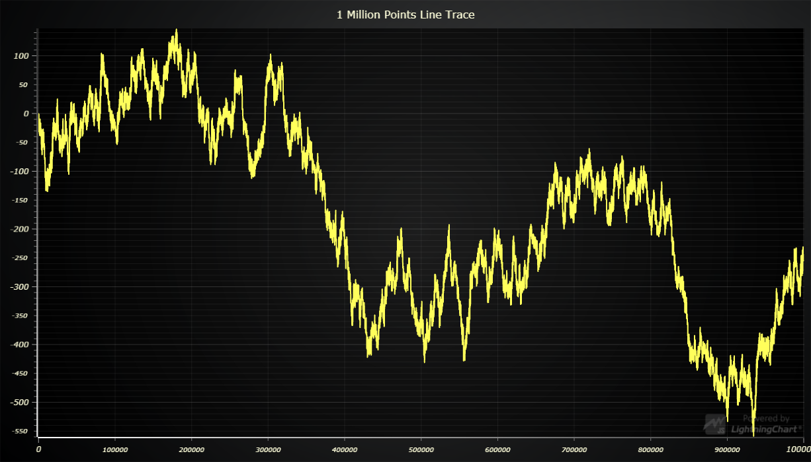

# 1 Million Points JavaScript Line Chart



This demo application belongs to the set of examples for LightningChart JS, data visualization library for JavaScript.

LightningChart JS is entirely GPU accelerated and performance optimized charting library for presenting massive amounts of data. It offers an easy way of creating sophisticated and interactive charts and adding them to your website or web application.

The demo can be used as an example or a seed project. Local execution requires the following steps:

- Make sure that relevant version of [Node.js](https://nodejs.org/en/download/) is installed
- Open the project folder in a terminal:

        npm install              # fetches dependencies
        npm start                # builds an application and starts the development server

- The application is available at *http://localhost:8080* in your browser, webpack-dev-server provides hot reload functionality.


## Description

This example plots a million data points in an instant using line series.

## Progressive data optimizations

By default, `LineSeries` can take list of XY coordinates in any order, connecting them with a line stroke.
However, in a lot of applications, the input data comes in a distinct order, for example, X coordinates describe a timestamp which increases between each consecutive data point. We refer to this as a *progressive data pattern*.

`LineSeries` is coupled together with highly sophisticated optimizations that can be enabled in applications where input data follows a *data pattern*. This example showcases the `'ProgressiveX'` *pattern*.

### Enabling data pattern optimizations

*Data pattern* must be specified when the *series* is created:

```typescript
// Create LineSeries with 'ProgressiveX' data pattern.
const series = ChartXY.addLineSeries({
    dataPattern: {
        // pattern: 'ProgressiveX' => Each consecutive data point has increased X coordinate.
        pattern: 'ProgressiveX',
        // regularProgressiveStep: true => The X step between each consecutive data point is regular (for example, always `1.0`).
        regularProgressiveStep: true,
    }
 })
```

Available *data patterns* are:
- `'ProgressiveX'`: Each consecutive data point has increased X coordinate.
- `'ProgressiveY'`: Each consecutive data point has increased Y coordinate.
- `'RegressiveX'`: Each consecutive data point has decreased X coordinate.
- `'RegressiveX'`: Each consecutive data point has decreased Y coordinate.

The pattern of data can be identified even further with the optional `regularProgressiveStep` property.
This can be enabled when the *progressive step* (for example, `'ProgressiveX'` -> X step) between each data point is regular, leading to even more significant optimizations.

### Side-effects and good to know

When a series is configured with a *data pattern*, the rendering process makes logical deductions and ssumptions on the user input data, according to the *data pattern* specification. **If the supplied input data does not follow the specification, rendering errors or even crashes can occur.** If you run into strange issues, first see if disabling the *data pattern* helps, or if your input data is somehow invalid.


## Automatic Axis scrolling

The scrolling of data in progressive series can also be automated and optimized by specifying ***ScrollStrategy*** for both x-axis & y-axis to perform the scrolling efficiently.

- Select ***AxisScrollStrategies.expansion***. Automatically increases a scale if some points are out of scale. Retains progressivity/regressivity of used scale.
- Select ***AxisScrollStrategies.fitting***. Automatically increases a scale if some points are out of scale and reduces it if there is too much empty space. Retains progressivity/regressivity of used scale.
- Select ***AxisScrollStrategies.progressive***. Automatically scrolls a scale in a positive direction.
- Select ***AxisScrollStrategies.regressive***. Automatically scrolls a scale to a negative direction.
- Pass ***undefined*** to disable automatic scrolling. Scale can then be manually set using *setInterval* method of ***Axis***


## API Links

* [XY cartesian chart]
* [Scroll strategies]
* [Line series]
* [Data patterns]
* [Progressive trace data generator]


## Support

If you notice an error in the example code, please open an issue on [GitHub][0] repository of the entire example.

Official [API documentation][1] can be found on [Arction][2] website.

If the docs and other materials do not solve your problem as well as implementation help is needed, ask on [StackOverflow][3] (tagged lightningchart).

If you think you found a bug in the LightningChart JavaScript library, please contact support@arction.com.

Direct developer email support can be purchased through a [Support Plan][4] or by contacting sales@arction.com.

[0]: https://github.com/Arction/
[1]: https://www.arction.com/lightningchart-js-api-documentation/
[2]: https://www.arction.com
[3]: https://stackoverflow.com/questions/tagged/lightningchart
[4]: https://www.arction.com/support-services/

© Arction Ltd 2009-2020. All rights reserved.


[XY cartesian chart]: https://www.arction.com/lightningchart-js-api-documentation/v3.0.1/classes/chartxy.html
[Scroll strategies]: https://www.arction.com/lightningchart-js-api-documentation/v3.0.1/globals.html#axisscrollstrategies
[Line series]: https://www.arction.com/lightningchart-js-api-documentation/v3.0.1/classes/lineseries.html
[Data patterns]: https://www.arction.com/lightningchart-js-api-documentation/v3.0.1/interfaces/datapattern.html
[Progressive trace data generator]: https://arction.github.io/xydata/classes/progressivetracegenerator.html

